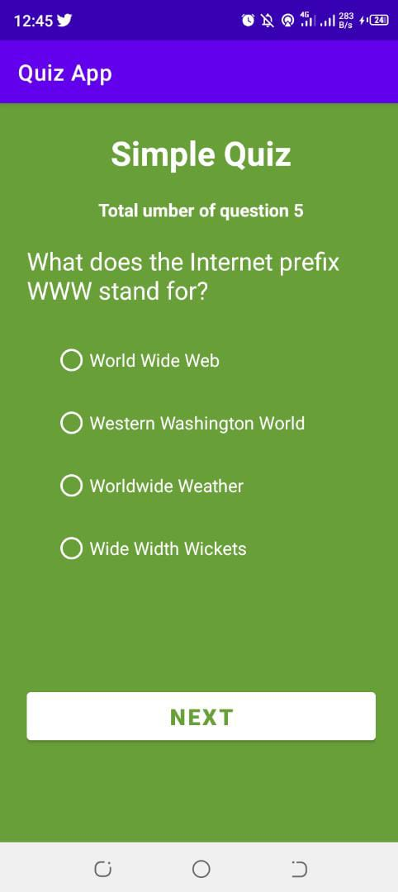

**Android Basics Nanodegree by Google** 

A Quiz App
===================================

A short Quiz App that quizzes a user about a certain topic
(Udacity course - Android Nanodegree Basics)

## Initial Preview

How to use this repository
--------------
- Fork this repository to your Github account.
- Open Android Studio 3.2.x+ in your local machine.
- Recommend you to use the [Version Control System](https://developer.android.com/studio/intro#version_control_basics)(VCS) in your Android Studio 3.2.x+ IDE to clone the repository directly in your IDE.

Prerequisites
--------------
- Android Studio 3.2.1 or higher
- compileSdkVersion 4 (For AndroidX dependencies, the min compileSdkVersion version is 4)
- minSdkVersion 16
- Supports up to Android 4.1
- Gradle 7.2.0

To run app in an Android Device (AVD), we have used the following configuration:
- Techno Spark 4
- API level 16
- Android 10

## Useful resources

- [Android Basics Nanodegree by Google - Udacity](https://www.udacity.com/course/android-basics-nanodegree-by-google--nd803) - Android Basics Nanodegree Program

